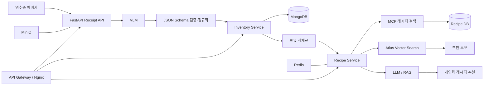

# KitchenList

> **영수증 한 장으로 식재료를 등록하고, 보유 재료에 맞는 요리를 추천하는 AI 주방 관리 서비스**

KitchenList는 영수증 이미지에서 구매 식재료를 추출·구조화하여 재고로 관리하고, 보유 식재료와 유통기한 정보를 바탕으로 레시피를 검색·추천하는 프로젝트입니다.

### [KitchenList 상세 포트폴리오 보기](https://github.com/Mobilian-KitchenList/kitchenlist-portfolio)

서비스 화면, 시스템 아키텍처, AI 파이프라인, 담당 역할과 기술적 의사결정을 확인할 수 있습니다.

## 핵심 기능

* **VLM 영수증 인식**: 영수증 이미지에서 상품명, 표준 식재료명, 수량, 용량, 가격 추출
* **식재료 데이터 정규화**: 불규칙한 VLM 출력을 서비스 스키마로 검증·보정
* **재고 관리**: 구매 식재료 등록 및 사용자별 보유 재료 조회
* **MCP 기반 레시피 수집**: 외부 레시피 검색 결과를 수집·정리·저장
* **RAG 추천**: 보유 식재료, 유통기한 임박 재료, 부족 재료를 반영한 레시피 추천
* **AI 서비스 인프라**: Docker Compose 기반 VLM·LLM·DB·스토리지·Gateway 통합 실행
* **통합 테스트**: GitHub Actions에서 MongoDB·MinIO 연동 테스트 자동화

## 서비스 흐름

## 시스템 구성

| 영역            | 기술                                                      |
| ------------- | ------------------------------------------------------- |
| AI/VLM        | Python, FastAPI, Ollama, LM Studio, Llama Vision        |
| 추천/RAG        | MCP, MongoDB Atlas Vector Search, OpenAI Embedding, LLM |
| Backend       | Spring Boot, FastAPI, API Gateway                       |
| Data          | MongoDB, Redis, MinIO                                   |
| Infra         | Docker Compose, Nginx, NVIDIA GPU                       |
| Observability | Elasticsearch, Kibana, APM Server                       |
| CI/Test       | GitHub Actions, pytest, MongoDB·MinIO 통합 테스트            |

## 주요 담당 영역

* VLM 기반 영수증 식재료 추출 및 JSON 구조화 파이프라인
* 모델 출력의 예외 형식 대응과 표준 식재료 스키마 정규화
* MCP 기반 레시피 검색·저장 기능
* 보유 식재료 기반 후보 검색 및 RAG 추천 API
* Ollama VLM·LLM, MongoDB, Redis, MinIO, Nginx를 포함한 로컬 AI 인프라
* API Gateway와 개별 서비스 간 Docker 네트워크·DNS·포트 연동
* GitHub Actions 기반 MongoDB·MinIO 통합 테스트

## 엔지니어링 포인트

### 1. 불안정한 VLM 출력을 서비스 데이터로 변환

모델이 반환하는 다양한 필드명과 불완전한 JSON을 안전하게 파싱하고, `rawName`, `standardName`, `detailType`, `quantity`, `volume`, `price` 형태의 일관된 스키마로 변환했습니다.

### 2. 검색과 추천을 고려한 데이터 설계

영수증 원문과 검색용 표준 식재료명을 분리하여 저장하고, 보유 재료·유통기한·수량 조건을 레시피 후보 검색과 벡터 검색에 활용할 수 있도록 구성했습니다.

### 3. 로컬에서도 재현 가능한 AI 서비스 환경

VLM과 LLM을 별도 Ollama 컨테이너로 구성하고 MongoDB, Redis, MinIO, Elasticsearch, Nginx와 동일 네트워크에서 실행하도록 설계했습니다. GPU 예약, health check, 영속 볼륨을 적용했습니다.

### 4. 외부 의존성을 포함한 통합 검증

GitHub Actions에서 MongoDB와 MinIO를 실제로 기동해 저장소·DB 연동 테스트를 수행하도록 구성했습니다.

## 저장소 공개 범위

현재 서비스 소스 저장소는 개발 중인 설정과 외부 연동 정보 보호를 위해 비공개로 관리하고 있습니다. 이 조직 페이지에는 공개 가능한 아키텍처, 역할, 기술적 의사결정과 결과를 정리합니다.

상세 서비스 화면과 구현 내용은
**[KitchenList Portfolio](https://github.com/Mobilian-KitchenList/kitchenlist-portfolio)**에서 확인할 수 있습니다.

## Contact

* GitHub: [gapple95](https://github.com/gapple95)
